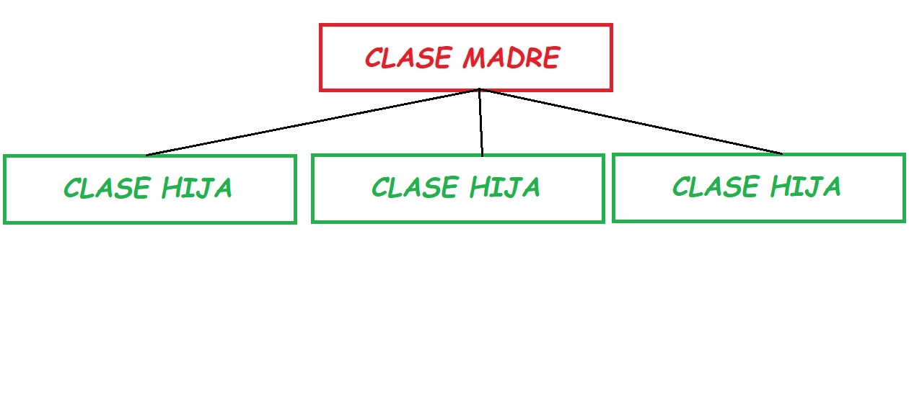
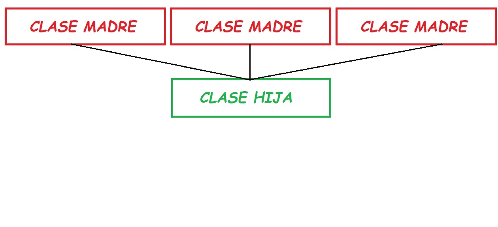

# HERENCIA

* La herencia es otra de las técnicas utilizadas en la POO. Consiste en que a partir de una clase (clase madre), podamosheredar y crear otras clases que llamaremos hijas. Se crea una jerarquía de clases, en la que la clase hija hereda las funcionalidades de su madre, además de tener las suyas propias.

* Existen dos tipos de herencia:

	* ***Herencia simple:*** Donde cada una de las clases hijas solo tiene una clase madre. Cada clases hijas especializa a la clase madre.

	* ***Herencia múltiple:*** Donde se tienen varias clases maders, y lo que se busca es una clase hija que agrupe todas las características que tienen sus clases madres.
	

* Ruby no tiene implementada la funcionalidad de *herencia múltiple*, sin embrgo nos ofrece mecanismos pra poder simularla.
